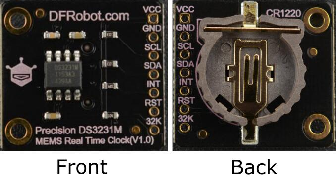
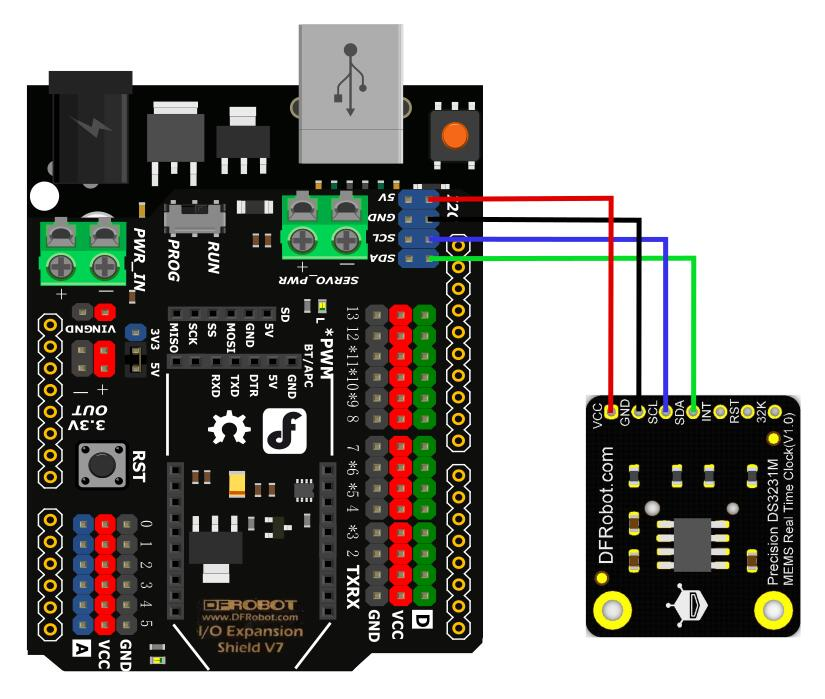

# DFRobot_DS3231M
DS3231M is a low-cost, extremely accurate, I2C real-time clock(RTC) module. It can provide ±5%ppm accuracy (no more than 0.432s error) within the whole temperature range and life span, and is compatible with 2.5-5.5V wide voltage range. The current comsuption of the module is as low as 2uA when powered by batteries. This module can be used to measure ambient temperature with ±3℃ accuracy. The integration of the microelectromechanical systems (MEMS) resonator enhances the stability and accuracy of the device. MEMS resonator is an upgraded version of traditional quartz crystal oscillator, and it has 25 times seismic resistance of the later as well as better temperature stability.   <br>

<br>

<br>

* Arduino UNO
<br>

<br>
   
## Table of Contents

* [Installation](#installation)
* [Methods](#methods)
* [Compatibility](#compatibility)
* [History](#history)
* [Credits](#credits)

## Installation

To use this library, first download the library file, paste it into the \Arduino\libraries directory, then open the examples folder and run the demo in the folder.

## Methods

```C++

  DFRobot_DS3231M(TwoWire *pWire = &Wire){_pWire = pWire;};
  ~DFRobot_DS3231M();
  /*!
   *@brief Init chip 
   *@return True means IIC communication succeeds, false means it fails. 
   */
  bool begin(void);
  /*!
   *@brief Get current time data
   */
  void getNowTime();
  
  /*!
   *@brief get year
   *@return year
   */
  uint16_t year();
  
  /*!
   *@brief get month
   *@return month
   */
  uint8_t  month();
  
  /*!
   *@brief get date
   *@return date
   */
  uint8_t  day();
  
  /*!
   *@brief get hour
   *@return hour
   */
  uint8_t  hour();
  
  /*!
   *@brief get minute
   *@return minute
   */
  uint8_t  minute();
  
  /*!
   *@brief get second
   *@return second
   */
  uint8_t  second();
  
  /*!
   *@brief get day of week
   *@return day of week
   */
  uint8_t  dayOfTheWeek() const ;
  
  /*!
   *@brief Set year
   *@param Year 
   */
  void setYear(uint8_t year);
  
  /*!
   *@brief Set month
   *@param Month
   */
  void setMonth(uint8_t month);
  
  /*!
   *@brief Set Date 
   *@param Date
   */
  void setDate(uint8_t date);
  
  /*!
   *@brief Set the hours and 12hours or 24hours
   *@param hour:1-12 in 12hours,0-23 in 24hours
   *@param mode:e24hours, eAM, ePM
   */
  void setHour(uint8_t hour, ehours mode);
  
  /*!
   *@brief Set minute 
   *@param Minute
   */
  void setMinute(uint8_t minute);
  
  /*!
   *@brief Set second
   *@param Second
   */
  void setSecond(uint8_t second);
  
  /*!
   *@brief Set the last compiled time as the current time 
   *@param date Input compiling  date 
   *@param time Input compiling time 
   */
  void dateTime(const __FlashStringHelper* date, const __FlashStringHelper* time);
  
  /*!
   *@brief Adjust current time 
   */
  void adjust();
  
  /*!
   *@brief output AM or PM of time 
   */
  const char* getAMorPM();
  
  /*!
   *@brief Get current temperature 
   *@return Current temperautre, unit: ℃ 
   */
  float getTemperatureC();
  
  /*!
   *@brief Judge if it is power-down 
   *@return If retrun true, power down, time needs to reset; false, work well. 
   */
  bool lostPower(void);
  
  /*!
   *@brief Read the value of pin sqw
   *@return eDS3231M_OFF             = 0x01 // Off
   *@n      eDS3231M_SquareWave_1Hz  = 0x00 // 1Hz square wave
   *@n      eDS3231M_SquareWave_1kHz = 0x08 // 1kHz square wave
   *@n      eDS3231M_SquareWave_4kHz = 0x10 // 4kHz square wave
   *@n      eDS3231M_SquareWave_8kHz = 0x18 // 8kHz square wave
   */
  eDs3231MSqwPinMode_t readSqwPinMode();
  
  /*!
   *@brief Set the vaule of pin sqw
   *@param mode eDS3231M_OFF             = 0x01 // Off
   *@n          eDS3231M_SquareWave_1Hz  = 0x00 // 1Hz square wave
   *@n          eDS3231M_SquareWave_1kHz = 0x08 // 1kHz square wave
   *@n          eDS3231M_SquareWave_4kHz = 0x10 // 4kHz square wave
   *@n          eDS3231M_SquareWave_8kHz = 0x18 // 8kHz square wave
   */
  void writeSqwPinMode(eDs3231MSqwPinMode_t mode);
  
  /*!
   *@brief Set alarm clock
   *@param alarmType Alarm clock working mode typedef enum{
   *@n                                  eEverySecond,
   *@n                                  eSecondsMatch,
   *@n                                  eSecondsMinutesMatch,
   *@n                                  eSecondsMinutesHoursMatch,
   *@n                                  eSecondsMinutesHoursDateMatch,
   *@n                                  eSecondsMinutesHoursDayMatch, //Alarm1
   *@n                                  eEveryMinute,
   *@n                                  eMinutesMatch,
   *@n                                  eMinutesHoursMatch,
   *@n                                  eMinutesHoursDateMatch,
   *@n                                  eMinutesHoursDayMatch,        //Alarm2
   *@n                                  eUnknownAlarm
   *@n                                  }eAlarmTypes;
   *@param days    Alarm clock Day (day)
   *@param hours   Alarm clock Hour (hour)
   *@param mode:   e24hours, eAM, ePM
   *@param minutes Alarm clock (minute)
   *@param seconds Alarm clock (second)
   */
  void setAlarm(const uint8_t alarmType,int16_t days,int8_t hours,ehours mode,
                int8_t minutes,int8_t seconds, const bool state  = true);
  
  /*!
   *@brief Judge if the alarm clock is triggered 
   *@return true, triggered; false, not trigger
   */
  bool isAlarm();
  /*!
   *@brief Clear trigger flag
   */
  void clearAlarm();
  
  /*!
   *@brief enable or disable the interrupt of alarm 
   */
  void enAbleAlarm1Int();
  void disAbleAlarm1Int();
  void enAbleAlarm2Int();
  void disAbleAlarm2Int();
  
  /*!
   *@brief enable the 32k output 
   */
  void enAble32k();
  
  /*!
   *@brief disable the 32k output 
   */
  void disAble32k();
```

## Compatibility

MCU                | Work Well    | Work Wrong   | Untested    | Remarks
------------------ | :----------: | :----------: | :---------: | -----
Arduino uno        |      √       |              |             | 
Mega2560        |      √       |              |             | 
Leonardo        |      √       |              |             | 
ESP32        |      √       |              |             | 
micro:bit        |      √       |              |             | 


## History

- Data 2019-8-19
- Version V0.1


## Credits

Written by(yufeng.luo@dfrobot.com), 2019. (Welcome to our [website](https://www.dfrobot.com/))


